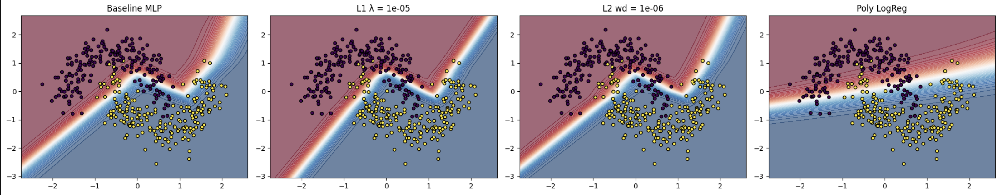
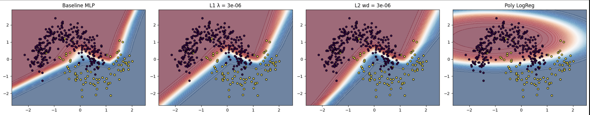

# Balanced dataset (imbalance = False)

## Validation Summary

- **Baseline MLP:** Early stopped at epoch $427$, Best Val AUC $= 0.9947$
- **Best $\ell_1$ Regularization:** $\lambda = 10^{-6}$, Val AUC $= 0.9955$
- **Best $\ell_2$ Regularization:** $wd = 10^{-6}$, Val AUC $= 0.9955$
- **Polynomial Logistic Regression:** Val AUC $= 0.9217$

## Test Accuracy across Noise Levels

| Noise Level | MLP        | $\ell_1$ ($\lambda = 10^{-6}$) | $\ell_2$ ($wd = 10^{-6}$) | Logistic Regression |
| ----------- | ---------- | ------------------------------ | ------------------------- | ------------------- |
| 0.10 (Low)  | **0.9998** | **1.0000**                     | **0.9999**                | 0.9629              |
| 0.20 (Med)  | 0.9893     | 0.9904                         | 0.9897                    | 0.9444              |
| 0.30 (High) | 0.9707     | 0.9695                         | 0.9715                    | 0.9329              |

## Parameter Counts

| Model                    | Parameters |
| ------------------------ | ---------- |
| MLP                      | 129        |
| $\ell_1$ Regularized MLP | 129        |
| $\ell_2$ Regularized MLP | 129        |

## Decision Boundaries

_Decision boundaries for all four models on balanced dataset (noise = 0.2)_  

- **Effect of $\ell_1$ Regularization:**  
  Encourages sparsity in the weight matrices — leading to _more jagged and axis-aligned_ decision boundaries due to selective feature use.
- **Effect of $\ell_2$ Regularization:**  
  Promotes smooth and continuous boundaries with better generalization margins.  
  The boundaries are less noisy but sometimes less sharp near the class overlap regions.

# Imbalanced Dataset (imbalance = True)

## Validation Summary

- **Baseline MLP:** Early stopped at epoch $767$, Best Val AUC $= 0.9834$
- **Best $\ell_1$ Regularization:** $\lambda = 10^{-5}$, Val AUC $= 0.9899$
- **Best $\ell_2$ Regularization:** $wd = 3 \times 10^{-6}$, Val AUC $= 0.9931$
- **Polynomial Logistic Regression:** Val AUC $= 0.9209$

## Test Accuracy across Noise Levels

| Noise Level | MLP    | $\ell_1$ ($\lambda = 10^{-5}$) | $\ell_2$ ($wd = 3 \times 10^{-6}$) | Logistic Regression |
| ----------- | ------ | ------------------------------ | ---------------------------------- | ------------------- |
| 0.10 (Low)  | 0.9971 | 0.9986                         | **0.9992**                         | 0.9621              |
| 0.20 (Med)  | 0.9835 | 0.9863                         | **0.9878**                         | 0.9432              |
| 0.30 (High) | 0.9697 | 0.9707                         | **0.9728**                         | 0.9334              |

## Parameter Counts

| Model                    | Parameters |
| ------------------------ | ---------- |
| MLP                      | 129        |
| $\ell_1$ Regularized MLP | 129        |
| $\ell_2$ Regularized MLP | 129        |

## Decision Boundaries

_Decision boundaries for all four models on imbalanced dataset (noise = 0.2)_  

- **Effect of Imbalance:**  
  The imbalance (70:30) skews learning toward the majority class, slightly reducing AUROC and calibration.  
  $\ell_1$ and $\ell_2$ still improve generalization, but the difference in AUROC across models becomes more pronounced.
- **AUROC Trends:**  
  Regularized models (especially $\ell_2$) maintain higher AUROC, indicating robustness to class imbalance.
- **Boundary Observations:**  
  Under imbalance, decision boundaries become biased toward the majority class region — visible in logistic regression and baseline MLP.

---

# Summary

| Dataset Type | Regularization | Best Hyperparameter     | Best Val AUC |
| ------------ | -------------- | ----------------------- | ------------ |
| Balanced     | $\ell_1$       | $\lambda = 10^{-6}$     | 0.9955       |
| Balanced     | $\ell_2$       | $wd = 10^{-6}$          | 0.9955       |
| Imbalanced   | $\ell_1$       | $\lambda = 10^{-5}$     | 0.9899       |
| Imbalanced   | $\ell_2$       | $wd = 3 \times 10^{-6}$ | 0.9931       |
